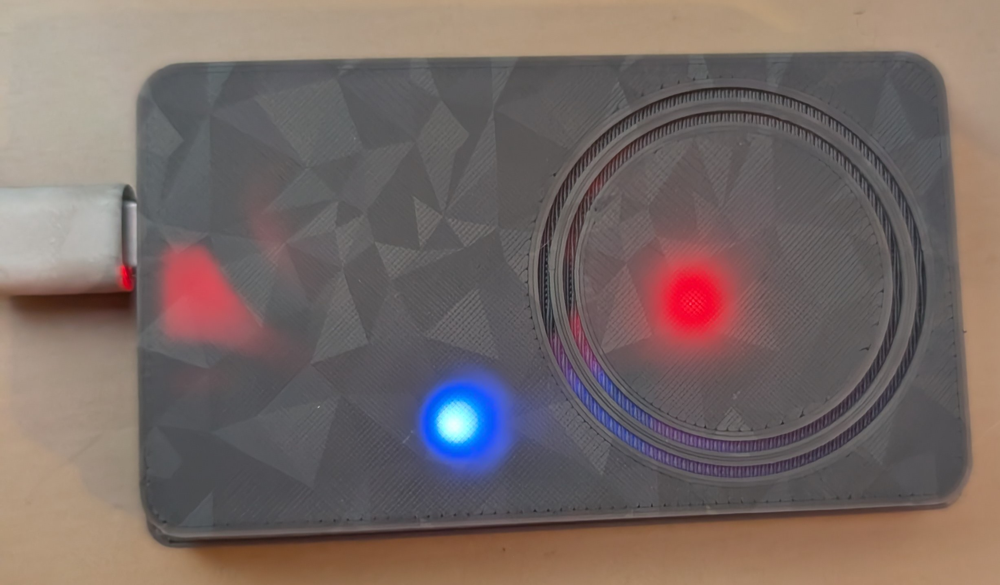
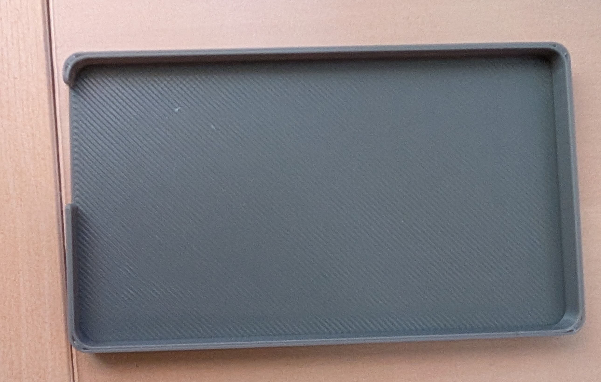

# 🔐 Lecteur RFID / NFC ESP32-C3 + PN532 pour Home Assistant

Projet de lecteur RFID/NFC compact basé sur **ESP32-C3 SuperMini** et module **PN532**, intégré à Home Assistant via **ESPHome**.

Ce projet permet de piloter une alarme (Alarmo ou autre) à l’aide de badges RFID/NFC, avec retour visuel et sonore.

---

## 📸 Photos du projet

### Lecteur RFID assemblé


### Supports d’impression 3D



---

## ✨ Fonctionnalités

- Lecture de badges RFID / NFC (13.56 MHz)
- Compatible Mifare Classic / Ultralight
- LED RGB **WS2812B** (1 LED)
- Buzzer actif pour retour sonore
- Compatible Home Assistant / Alarmo
- Connexion WiFi via ESPHome

---

## 📦 Matériel nécessaire

| Composant | Lien |
|----------|------|
| ESP32-C3 Super Mini | https://a.aliexpress.com/_EJZljtQ |
| Module RFID/NFC PN532 | https://a.aliexpress.com/_EyM0ts8 |
| LED WS2812B RGB | https://a.aliexpress.com/_Ez9va3q |

---

## 🔌 Schéma de câblage (ESP32-C3 SuperMini)

### Connexions PN532 → ESP32-C3

| PN532 | ESP32-C3 SuperMini | Remarque |
|------|--------------------|---------|
| VCC  | 5V ou 3V3 | Selon votre module PN532 |
| GND  | GND | Masse commune |
| SDA  | GPIO5 | Bus I2C (données) |
| SCL  | GPIO6 | Bus I2C (horloge) |

### Connexions LED WS2812B

| LED WS2812B | ESP32-C3 |
|------------|---------|
| VCC | 5V |
| GND | GND |
| DIN | GPIO2 |

⚠️ Respecter le sens de la flèche sur la LED (flux du signal).

### Connexions Buzzer

| Buzzer | ESP32-C3 |
|--------|---------|
| + | GPIO7 |
| – | GND |

> Tous les GND doivent être reliés ensemble.

---

## 🧠 Fonctionnement

| Couleur LED | Signification |
|------------|---------------|
| 🔵 Bleu | En attente de badge |
| 🟢 Vert | Badge reconnu |
| 🔴 Rouge | Badge inconnu |

Le buzzer émet un bip à chaque détection.

---

## ⚡ Installation

### 1. Installer ESPHome

Dans Home Assistant :

Paramètres → Extensions → ESPHome


### 2. Flasher l’ESP32

Utiliser le fichier :

esphome/lecteur-rfid.yaml


### 3. Ajouter dans Home Assistant

Une fois flashé, le lecteur apparaît automatiquement comme nouvel appareil.

---

## 🏠 Exemple d’automatisation Home Assistant

Automatisation simple ON/OFF de l’alarme avec un badge :

```yaml
alias: 🔐 RFID - Activation/Désactivation alarme
trigger:
  - platform: state
    entity_id: binary_sensor.lecteur_rfid_badge_autorise
    to: "on"

action:
  - choose:
      - conditions:
          - condition: state
            entity_id: alarm_control_panel.alarme_maison
            state: "disarmed"
        sequence:
          - service: alarm_control_panel.alarm_arm_away
            target:
              entity_id: alarm_control_panel.alarme_maison

      - conditions:
          - condition: not
            conditions:
              - condition: state
                entity_id: alarm_control_panel.alarme_maison
                state: "disarmed"
        sequence:
          - service: alarm_control_panel.alarm_disarm
            data:
              code: "3650"
            target:
              entity_id: alarm_control_panel.alarme_maison
mode: single
🧾 Licence
Projet personnel — libre d’utilisation et de modification.
```
🙌 Remerciements
Boîtier 3D basé sur le projet MakerWorld : https://makerworld.com/fr/models/1117728-nfc-tag-reader-esp8266-32-c6-c3-supermini-pn532?from=search#profileId-1115525
